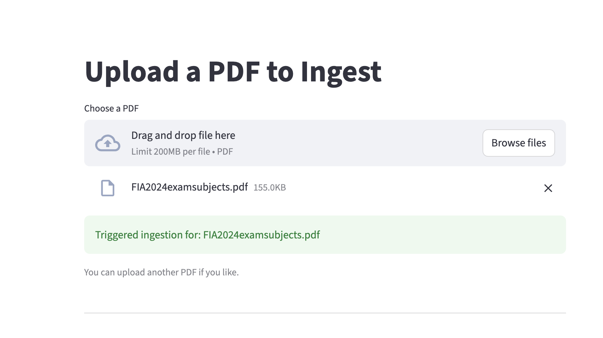
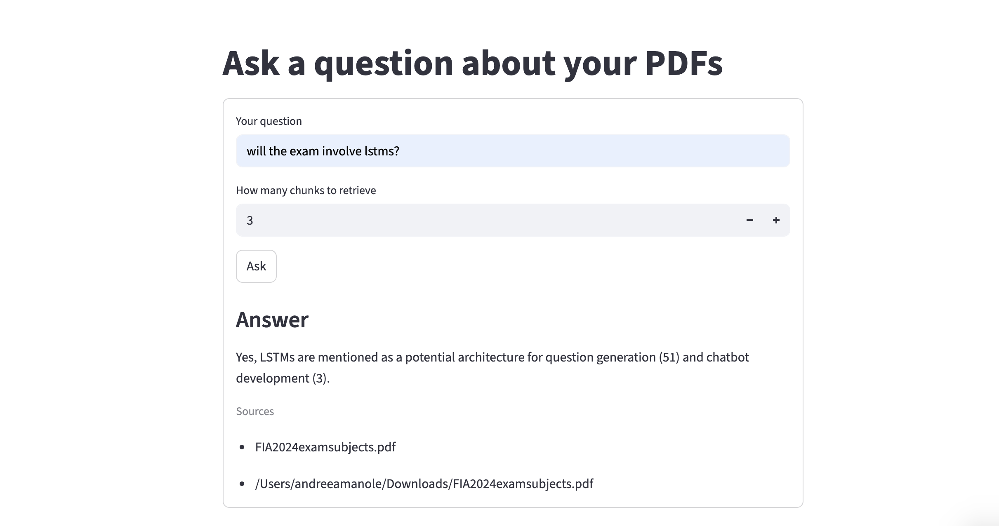

# RAGent

Local RAG system using Ollama for LLM, Qdrant for vector storage, and Inngest for async workflows. Ingests PDFs, splits them into chunks, generates embeddings, and answers questions using retrieved context. Runs completely offline without external APIs.

## Main Files

- `main.py` - FastAPI server with Inngest functions for ingest and query
- `data_loader.py` - PDF chunking and embedding using sentence-transformers
- `vector_db.py` - Qdrant client for vector search
- `streamlit_app.py` - Web UI

## How RAG Works

1. Ingest: PDF is split into text chunks (1000 chars with 200 overlap). Each chunk is converted to a 384-dimension vector using sentence-transformers and stored in Qdrant.
2. Query: User question is converted to same vector format. Qdrant finds top-k most similar chunks using cosine similarity.
3. Generate: Retrieved chunks are sent as context to Ollama (Gemma2:2b) which generates an answer using only the provided context.

## Inngest

Inngest handles async event-driven functions with retry logic. Two functions: `rag/ingest_pdf` for PDF processing and `rag/query_pdf_ai` for question answering. Functions run as background jobs with automatic retries on failure.

## Vector Database

Qdrant stores embeddings with 384 dimensions using cosine distance. Each point has an id, vector, and payload containing source filename and original text. Collection auto-creates on first use.

## How to Run

Terminal 1 - Start Ollama:

```
ollama serve
```

Terminal 2 - Start Qdrant:

```
docker run -d --name qdrantRagDb -p 6333:6333 qdrant/qdrant
```

Terminal 3 - Start FastAPI:

```
uv run uvicorn main:app
```

Terminal 4 - Start Inngest:

```
npx inngest-cli@latest dev -u http://127.0.0.1:8000
```

Terminal 5 - Start Streamlit:

```
uv run streamlit run streamlit_app.py
```

## Usage Example

Ingest a PDF:

```json
{
  "pdf_path": "/Users/andreeamanole/Downloads/FIA2024examsubjects.pdf"
}
```

Response:

```json
{
  "ingested": 10
}
```

Query the PDF:

```json
{
  "question": "will the exam contain anything lstm related?"
}
```

Response:

```json
{
  "answer": "Yes, LSTM is mentioned as a potential solution for time series prediction.",
  "num_contexts": 5,
  "sources": ["/Users/andreeamanole/Downloads/FIA2024examsubjects.pdf"]
}
```

## Screenshots




